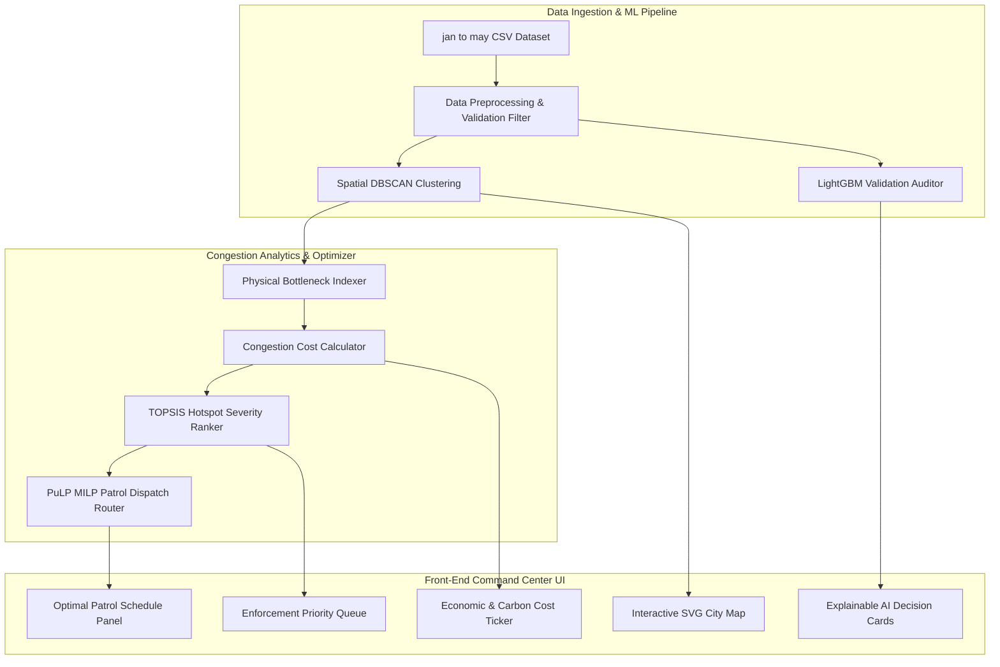

```bash
traffic-control@city:~$ parksight --start

🚦 ParkSight
Detect. Prioritize. Optimize.

Status: OPERATIONAL
Hotspots: 214
Critical Zones: 12
Resources Optimized: ACTIVE
```

### Detect. Prioritize. Optimize.

AI-Powered Parking Intelligence & Congestion Mitigation Platform

</div>

> Detect. Prioritize. Optimize.
> **Detect. Prioritize. Optimize.**

PARKSIGHT is an AI-powered Parking Intelligence and Traffic Operations Command Center designed for municipal traffic authorities (such as the Bangalore Traffic Police). It transitions parking enforcement from reactive patrolling to data-driven congestion mitigation by identifying chronic parking bottlenecks, quantifying their economic/environmental costs, and optimizing patrol dispatches.

---

## Core Modules & Algorithms

1.  **Spatio-Temporal Hotspot Classifier (ST-DBSCAN)**:
    *   Instead of static density heatmaps, the system clusters 298,450 historical violation coordinates into **214 chronic hotspots** using Density-Based Spatial Clustering (DBSCAN), separating transient stops from persistent bottlenecks.
2.  **Congestion Impact Score (CIS) Engine**:
    *   Since blocking duration is missing in raw logs, we calculate a **Physical Bottleneck Index (PBI)**:
        $$\text{CIS} = W_{\text{size}} \times W_{\text{type}} \times W_{\text{road}}$$
    *   *Weights*: Vehicle Footprint ($W_{\text{size}}$ from Passenger Car Units), Violation Severity ($W_{\text{type}}$ from double-parking/footpath rules), and Road Capacity ($W_{\text{road}}$ from OpenStreetMap hierarchy and junction proximity).
3.  **Congestion Cost Calculator**:
    *   Translates traffic blockages into real economic and environmental metrics using Indian Road Congress (IRC) delay formulas:
        *   **Economic Loss (INR)**: Passenger Delay Hours $\times$ Value of Time (VOT baseline: ₹150/hr).
        *   **Carbon Footprint (t CO₂)**: Fuel wasted in idling ($1.2\text{ L/hr}$) $\times$ standard gasoline emissions ($2.3\text{ kg CO₂/L}$).
4.  **Ranked Hotspots Prioritization Index (TOPSIS)**:
    *   Ranks hotspots dynamically using the **Technique for Order of Preference by Similarity to Ideal Solution (TOPSIS)** across multiple criteria (Total CIS, Economic Loss, Officer Approval Rate, and Recidivism).
5.  **Enforcement Resource Routing Optimizer (MILP)**:
    *   Formulates patrol routing as a Capacitated Vehicle Routing Problem with Time Windows (CVRPTW). It solves a **Mixed Integer Linear Programming (MILP)** model using the PuLP library to allocate patrol units and tow trucks from police stations to hotspots to maximize economic cost relief.
6.  **Explainable AI (XAI) Auditor**:
    *   Uses a LightGBM validation classifier trained on officer metadata (`created_by_id`, `device_id`) and coordinates to predict the probability of violation approval, acting as a data quality filter. Natural Language Generation (NLG) cards explain the priority reasons to dispatchers in real-time.

---

## System Architecture



---

## Repository Structure

```
ravencore06/ParkSight (Git Root)
├── package.json             # Root package manager (build orchestrator)
├── vercel.json              # Vercel static build configuration
├── .gitignore               # Root git ignore patterns (excludes large datasets)
├── README.md                # System documentation
├── frontend/                # React Web Application (Vite + Recharts)
│   ├── package.json
│   ├── vite.config.js
│   ├── src/
│   │   ├── App.jsx          # Stateful UI, SVG Map, Optimizer & Simulator
│   │   ├── index.css        # Command Center Theme Styles
│   │   └── main.jsx
│   └── public/
└── backend/                 # Data Pipeline & Machine Learning Models
    ├── preprocess_and_train.py  # Clusters coordinates & trains LightGBM model
    ├── app.py                   # Reference Streamlit app implementation
    ├── encoders_and_model.pkl   # Trained classifier weights and label encoders
    ├── requirements.txt         # Python dependencies
    └── Project Report...pdf     # Operations report
```

---

## Local Setup Guide

### 1. Run the Frontend (React + Vite)
Ensure you have [Node.js](https://nodejs.org/) installed:
```bash
cd frontend
npm install
npm run dev
```
Open [http://localhost:5173/](http://localhost:5173/) in your browser.

### 2. Run the Backend (Python)
Ensure you have [Python 3.10+](https://www.python.org/) installed:
```bash
cd backend
python -m venv .venv
.venv\Scripts\activate  # On macOS/Linux: source .venv/bin/activate
pip install -r requirements.txt
python preprocess_and_train.py
```

---

##  Production Deployment (Vercel)

This repository is optimized for automated **Vercel** deployments. To host the frontend, configure the following setting in Vercel:

1.  Go to your **Vercel Project Settings**.
2.  Under **General**, locate the **Root Directory** field.
3.  Set it to: `frontend`
4.  Click **Save** and trigger a **Redeploy**.

*(Vercel will now automatically compile the Vite application inside `/frontend` and host the static dashboard at your production URL.)*
